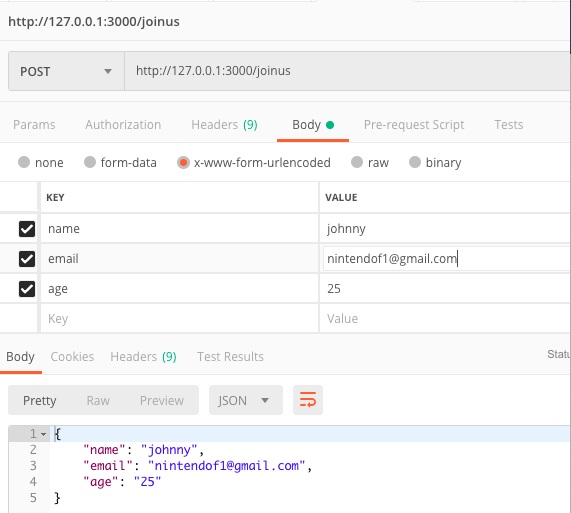

# RESTful POST 方法
### POST body x-www-form-urlencoded
server端的程式碼
```javascript=
// POST 參數
// POST /joinus gets urlencoded bodies
// http://127.0.0.1:3000/joinus
// body x-www-form-urlencoded
app.post('/joinus',urlencodedParser,(req,res) =>{
    // console.log('join us ...');
    if(!req.body) {
        res.send("POST no body data ...");
    } else {
        let myJoinUs = req.body;
        console.log(req.body);
        res.json(myJoinUs);
        res.end();
    }
})
```
postman 測試方法


### 前端相對應網頁Joinus_form.html
```htmlmixed=
<form action="/joinus" method="POST">
    Name: <input type="text" name="name"> <br>
    Email: <input type="email" name="email"> <br>
    AGE: <input type="text" name="age"> <br>
    <input type="submit" value="送出">
</form>
```
