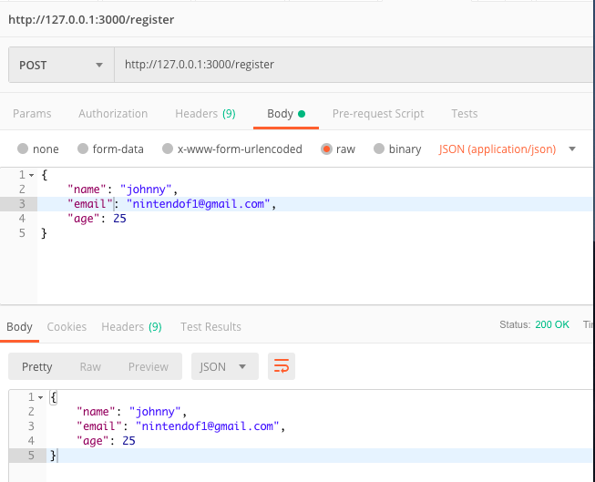

# RESTful POST 方法
### POST body x-www-form-urlencoded
server端的程式碼
```javascript=
// POST 參數
// POST /joinus gets urlencoded bodies
// http://127.0.0.1:3000/joinus
// body x-www-form-urlencoded
app.post('/joinus',urlencodedParser,(req,res) =>{
    // console.log('join us ...');
    if(!req.body) {
        res.send("POST no body data ...");
    } else {
        let myJoinUs = req.body;
        console.log(req.body);
        res.json(myJoinUs);
        res.end();
    }
})
```
### postman 測試方法 1


### 前端相對應網頁Joinus_form.html
```htmlmixed=
<form action="/joinus" method="POST">
    Name: <input type="text" name="name"> <br>
    Email: <input type="email" name="email"> <br>
    AGE: <input type="text" name="age"> <br>
    <input type="submit" value="送出">
</form>
```

---

### POST body x-www-form-urlencoded
server端的程式碼
```javascript=
// POST 參數
// POST /register gets JOSN bodies
// http://127.0.0.1:3000/register 
// Body raw JSON
app.post('/register',jsonParser,(req,res)=>{
    // console.log("Post register ...");
    if(!req.body){
        res.send("Blank data");
    }else {
        res.send(req.body);
        res.end();
    }
})
```

### postman 測試方法 2



### 前端相對應網頁Joinus_json.html
```htmlmixed=
<body>
    <form>
        Name: <input id="name" type="text" name="name"> <br>
        Email: <input id="email" type="email" name="email"> <br>
        AGE: <input id="age" type="text" name="age"> <br>
        <input id="jsonClick" type="button" value="送出">
    </form>
    <div id="result"></div>
</body>
```
```javascript=
// html網頁ready
$(document).ready(function(){
    // 啟用api click方法
    $("#jsonClick").click((e) => {
        // 不回應表單submit
        e.preventDefault();
        // console.log("call api");
        // 取得input內容
        let myname = $("#name").val();
        let myemail = $("#email").val();
        let myage = $("#age").val();
        // console.log("call", myname, myemail, myage);
        var myData = {
            "name" : myname,
            "email" : myemail,
            "age" : myage
        }
        // console.log("json", myData);
        // 用ajax呼叫api路徑
        $.ajax('/register',{
            type:"POST",
            data:JSON.stringify(myData),
            dataType:"json",
            contentType: "application/json",
            success: (data,status) => {
                // console.log(data);
                // console.log(status);
                let myhtml = data.name + '<br>' + data.email + '<br>' + data.age
                $("#result").html(myhtml);
            },
            error:(error) => {
                console.log(error);
            }
        });
    });
});
```